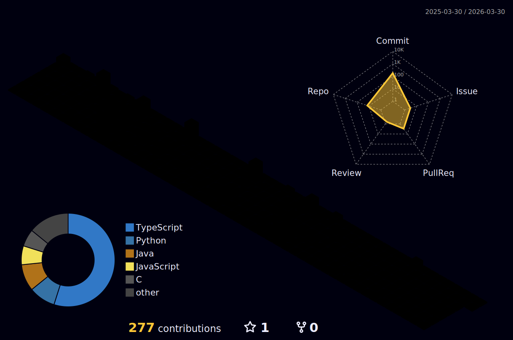

  

<h1 align="center">⚔️ Bem-vindo aos Salões de Código de Alessandro ⚔️</h1>

  <em>"No Reino das Lógicas e Runas Digitais, ele escreve sua lenda em linhas de código eterno."</em>

  
  
  

---

### 🏆 Troféus do Cavaleiro

---

### 📜 Títulos Concedidos pela Ordem dos Desenvolvedores

🛡️ `Cavaleiro do Repositório Eterno`  
⚔️ `Matador de Bugs Ancestrais`  
🔮 `Mestre do Algoritmo Sagrado`  
🏰 `Guardião dos Commits Perdidos`  
📡 `Senhor dos Sinais Binários`  
👑 `Arquimago da Interface Sombria`  
🔥 `⚔️ Matador de Bugs Ancestrais`

---

### 📫 Entre no Reino:

- 🔗 [Portfólio (KINGDOM_OF_CODE)](https://github.com/alessandro0augusto0/Portfolio)
- 🛡️ [Repositório de Batalha (KNIGHT_OF_THE_REPOSITORY)](https://github.com/alessandro0augusto0/Clima-com-WeatherAPI)
- 🐉 [Desafio do Dragão (DRAGON_SLAYER)](https://github.com/alessandro0augusto0/Caixeiro-Viajante)
- 🔥 [Fogo de Prometeu (BURNING_DRAGON_SOUL)](https://github.com/alessandro0augusto0/Cache-Simulator)

  
  
  > **Engenheiro de Computação em Formação** | **Trainee em Projetos** na [EJ Turing](https://instagram.com/ej_turing)  
  > Desenvolvendo soluções com **Next.js e React Native** para clientes reais  
  > *"Transformando café em código desde 2022 ☕→💻 | Commit a day keeps the bugs away! 🐛💻"*
  
   
  
  
  
  

   

  
  

## 🛠️ Tech Stack

### 🌐 Frontend Web

  
  
  

### 🖥️ Backend & Sistemas

  
  
  

### 🏢 Tecnologias na EJ Turing

📱 Stack de Projetos na Empresa Júnior

  
  
  

## 🛠️ Tech Stack (Categorizado)

### 👨‍💻 IDEs & Ferramentas de Desenvolvimento

  

### 🌐 Linguagens & Frameworks Frontend

  

### ⚙️ Backend & Outras Linguagens

  

## 🔥 Projetos Destacados

  
**Stack**: Next.js, Tailwind, Node.js  
**Destaque**: Plataforma de processos seletivos que reduziu o tempo de triagem em 40%

  
**Stack**: React, Firebase, Material UI  
**Destaque**: PWA para bibliotecas com sincronização offline

## 🌦️ Projetos de Clima em Tempo Real

### ⚡ Versão Simplificada (HTML puro)
  
**Stack**:  
- HTML5 semântico  
- CSS3 puro (Flexbox/Grid)  
- JavaScript ES6+  
- OpenWeatherMap API  

**Diferencial**:  
✔️ Carregamento ultra-rápido (<1s)  
✔️ Design responsivo mobile-first  
✔️ Integração direta com API REST  

---

### 🚀 Versão Avançada (Vite + TS)
  
**Stack**:  
- Vite (build tool)  
- TypeScript  
- WeatherAPI.com  
- CSS Modules  

**Diferencial**:  
✔️ Tipagem estática com TS  
✔️ Hot Module Replacement  
✔️ Cache inteligente de requests  
✔️ Design system escalável  

📊 Comparação Técnica

| Feature               | HTML Version       | Vite Version        |
|-----------------------|--------------------|---------------------|
| TTI (Time to Interactive) | 0.8s           | 1.2s               |
| Bundle Size           | 12KB              | 45KB (gzipped)     |
| API Calls             | 1/sec             | 3/sec (cache)      |
| Lighthouse Score      | 98                | 94                 |

  
  

## 🌐 Portfólio & Currículo

